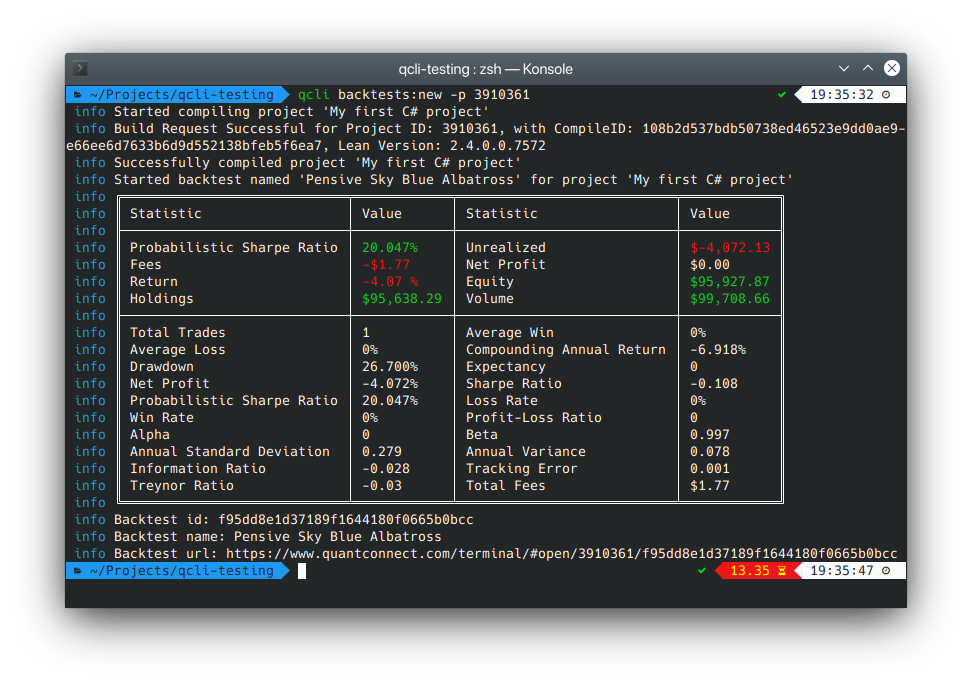

# QuantConnect CLI

[](https://github.com/jmerle/quantconnect-cli/actions?query=workflow%3ABuild)
[](https://npmjs.org/package/quantconnect-cli)
[](https://github.com/jmerle/quantconnect-cli/blob/master/LICENSE)
[](https://oclif.io)

QuantConnect CLI is a CLI aimed at making local development of QuantConnect algorithms easier. It makes it easy to synchronize projects between your local drive and QuantConnect and supports running backtests from the terminal.



# Install

```
$ npm install --global quantconnect-cli
# or
$ yarn global add quantconnect-cli
```

After installing using the instructions above, simply `cd` into an empty directory and run `qcli init` to set-up a QuantConnect CLI project.

# Usage

A workflow with QuantConnect CLI may look like this:
1. `cd` into the QuantConnect CLI project.
2. Run `qcli files:pull` to pull remotely changed files.
3. Run `qcli files:watch` to start watching for file changes which will be pushed to QuantConnect when they happen.
4. Open a new terminal and `cd` into the QuantConnect CLI project again (keep `qcli files:watch` running in the other terminal).
5. Start programming and run backtests with `qcli backtests:new --open` whenever there is something to backtest. The `--open` flag means that the backtest results will be opened in the browser when done. Additionally, you can specify the project id or name with `--project <project id or name>` if you don't want the interactive selector to open every time.

Whenever you create a new algorithm or Alpha Stream via the web interface, quit the `qcli files:watch` command, run `qcli files:pull` and start `qcli files:watch` again.

`qcli files:pull`, `qcli files:push` and `qcli files:watch` all accept a `--project` flag to only pull/push/watch a single project. The value of this flag can be either the id of the project or its name.

# Commands

<!-- commands -->
* [`qcli api:get ENDPOINT`](#qcli-apiget-endpoint)
* [`qcli api:post ENDPOINT`](#qcli-apipost-endpoint)
* [`qcli backtests:list`](#qcli-backtestslist)
* [`qcli backtests:new`](#qcli-backtestsnew)
* [`qcli backtests:report`](#qcli-backtestsreport)
* [`qcli backtests:results`](#qcli-backtestsresults)
* [`qcli files:pull`](#qcli-filespull)
* [`qcli files:push`](#qcli-filespush)
* [`qcli files:watch`](#qcli-fileswatch)
* [`qcli help [COMMAND]`](#qcli-help-command)
* [`qcli init`](#qcli-init)
* [`qcli projects:compile`](#qcli-projectscompile)
* [`qcli projects:delete`](#qcli-projectsdelete)
* [`qcli projects:list`](#qcli-projectslist)

## `qcli api:get ENDPOINT`

make an authenticated GET request to the QuantConnect API

```
USAGE
  $ qcli api:get ENDPOINT

ARGUMENTS
  ENDPOINT  API endpoint to send the request to

OPTIONS
  -h, --help     display usage information
  -v, --version  display version information

EXAMPLE
  $ qcli api:get authenticate
  {
     "success": true
  }
```

_See code: [src/commands/api/get.ts](src/commands/api/get.ts)_

## `qcli api:post ENDPOINT`

make an authenticated POST request to the QuantConnect API

```
USAGE
  $ qcli api:post ENDPOINT

ARGUMENTS
  ENDPOINT  API endpoint to send the request to

OPTIONS
  -b, --body=body  JSON string containing the data to use as body of the request
  -h, --help       display usage information
  -v, --version    display version information

EXAMPLE
  $ qcli api:post files/create --body '{ "projectId": 1234567, "name": "Empty.cs", "content": "// Empty file" }'
  {
     "files": [
       {
         "id": 1234567,
         "uid": 12345,
         "pid": 1234567,
         "fpid": 0,
         "sname": "Empty.cs",
         "scontent": "// Empty file",
         "dtcreated": "2020-01-01 00:00:00",
         "dtmodified": "2020-01-01 00:00:00",
         "estatus": "Active",
         "etype": "File",
         "bopen": 0
       }
     ],
     "success": true
  }
```

_See code: [src/commands/api/post.ts](src/commands/api/post.ts)_

## `qcli backtests:list`

list all backtests for a project

```
USAGE
  $ qcli backtests:list

OPTIONS
  -h, --help             display usage information
  -p, --project=project  project id or name (optional, interactive selector opens if not specified)
  -v, --version          display version information
```

_See code: [src/commands/backtests/list.ts](src/commands/backtests/list.ts)_

## `qcli backtests:new`

launch a backtest for a project

```
USAGE
  $ qcli backtests:new

OPTIONS
  -h, --help             display usage information
  -n, --name=name        name of the backtest (optional, a random one is generated if not specified)
  -o, --open             open the backtest results in the browser when done
  -p, --project=project  project id or name (optional, interactive selector opens if not specified)
  -v, --version          display version information
```

_See code: [src/commands/backtests/new.ts](src/commands/backtests/new.ts)_

## `qcli backtests:report`

download the report of a given backtest

```
USAGE
  $ qcli backtests:report

OPTIONS
  -b, --backtest=backtest  backtest id or name (optional, interactive selector opens if not specified)
  -h, --help               display usage information
  -p, --project=project    project id or name (optional, interactive selector opens if not specified)
  -v, --version            display version information
  --open                   open the report in the browser when done
  --overwrite              overwrite the file if it already exists
  --path=path              path to save report to (optional, backtest name is used if not specified)
```

_See code: [src/commands/backtests/report.ts](src/commands/backtests/report.ts)_

## `qcli backtests:results`

show the results of a given backtest

```
USAGE
  $ qcli backtests:results

OPTIONS
  -b, --backtest=backtest  backtest id or name (optional, interactive selector opens if not specified)
  -h, --help               display usage information
  -o, --open               open the backtest results in the browser
  -p, --project=project    project id or name (optional, interactive selector opens if not specified)
  -v, --version            display version information
```

_See code: [src/commands/backtests/results.ts](src/commands/backtests/results.ts)_

## `qcli files:pull`

pull files from QuantConnect to the current directory

```
USAGE
  $ qcli files:pull

OPTIONS
  -h, --help             display usage information
  -p, --project=project  project id or name of the project to pull (all projects if not specified)
  -v, --version          display version information
```

_See code: [src/commands/files/pull.ts](src/commands/files/pull.ts)_

## `qcli files:push`

push local files to QuantConnect

```
USAGE
  $ qcli files:push

OPTIONS
  -h, --help             display usage information
  -p, --project=project  project id or name of the project to push (all projects if not specified)
  -v, --version          display version information
```

_See code: [src/commands/files/push.ts](src/commands/files/push.ts)_

## `qcli files:watch`

watch for local file changes and push them to QuantConnect

```
USAGE
  $ qcli files:watch

OPTIONS
  -h, --help             display usage information
  -p, --project=project  project id or name of the project to watch (all projects if not specified)
  -v, --version          display version information
  --poll                 use polling to watch for file changes
```

_See code: [src/commands/files/watch.ts](src/commands/files/watch.ts)_

## `qcli help [COMMAND]`

display help for qcli

```
USAGE
  $ qcli help [COMMAND]

ARGUMENTS
  COMMAND  command to show help for

OPTIONS
  --all  see all commands in CLI
```

_See code: [@oclif/plugin-help](https://github.com/oclif/plugin-help/blob/v3.1.0/src/commands/help.ts)_

## `qcli init`

create a new QuantConnect CLI project

```
USAGE
  $ qcli init

OPTIONS
  -h, --help     display usage information
  -v, --version  display version information
```

_See code: [src/commands/init.ts](src/commands/init.ts)_

## `qcli projects:compile`

compile a project

```
USAGE
  $ qcli projects:compile

OPTIONS
  -h, --help             display usage information
  -p, --project=project  project id or name (optional, interactive selector opens if not specified)
  -v, --version          display version information
```

_See code: [src/commands/projects/compile.ts](src/commands/projects/compile.ts)_

## `qcli projects:delete`

delete a project

```
USAGE
  $ qcli projects:delete

OPTIONS
  -h, --help             display usage information
  -p, --project=project  project id or name (optional, interactive selector opens if not specified)
  -v, --version          display version information
```

_See code: [src/commands/projects/delete.ts](src/commands/projects/delete.ts)_

## `qcli projects:list`

list all projects

```
USAGE
  $ qcli projects:list

OPTIONS
  -h, --help     display usage information
  -v, --version  display version information
```

_See code: [src/commands/projects/list.ts](src/commands/projects/list.ts)_
<!-- commandsstop -->

# Contributing

All contributions are welcome. Please read the [Contributing Guide](CONTRIBUTING.md) first as it contains information regarding the tools used by the project and instructions on how to set up a development environment.
